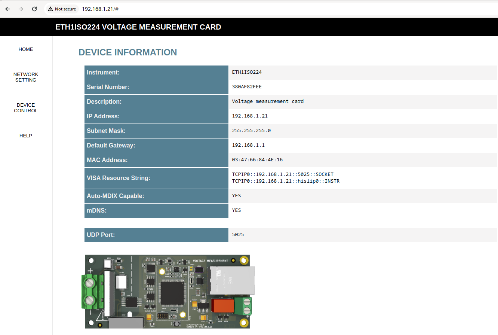
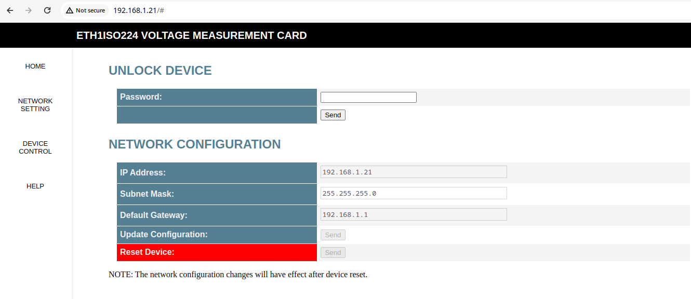

<h1>ETH1ISO224</h1>

ETH1ISO224 is a one-channel data acquisition card based on the ISO224 chip. The communication with a PC is over Ethernet. The card supports LAN eXtensions for Instrumentation (LXI) and RAW TCP and UDP connections.

> [!CAUTION]
> This design is still in verification phase. The device requires a calibration and validation to be done.

<h2>DESCRIPTION</h2>

<h3>Device Design</h3>

Key features of the design include:

<ul>
    <li><b>Dimensions</b>: 100 x 45 mm</li>
    <li><b>Power Supply</b>: Operates on a voltage range from 6.5 to 36 VDC (recommended 24 VDC) and includes reverse voltage protection.</li>
    <li><b>Isolation</b>: The ISO224 chip with TBA 1-0513HI provides isolation protection for the rest of the circuit.</li>
    <li><b>MCU</b>: The STM32H743VITx was selected because of its large internal FLASH and RAM memory, support for Ethernet, and internal 16-bit ADC.</li>
    <li><b>ADC</b>: Internal 16 bit ADC, configured in differential mode.</li>
    <li><b>Software</b>: FreeRTOS with lwip and SCPI parser library.</li>
</ul>

3D model rendition for PCB V1.2.

</img>

Below are the images for the PCB V1.0.

</img>

</img>

</img>

<h3>Input voltage</h3>

The PCB was designed for max bipolar 1000V DC measurements. It will divide the input voltage by 100. The user can use 1776-C68xx or SMD resistors to create the voltage divider.

> [!CAUTION]
> The PCB is still in verification. There are no guarantees that it can handle 1000 VDC safely.

<h2>Ethernet connection</h2>

The PCB uses Ethernet to communicate with the PC. The features are :

<h3>LAN eXtensions for Instrumentation (LXI)</h3>

LAN eXtensions for Instrumentation (LXI) is a standard for connecting and controlling test and measurement instruments via Ethernet. It allows for easy integration, remote access, and simplified configuration, enhancing the flexibility and scalability of automated test systems.

> [!WARNING]  
> This device does not guarantee full compliance with the LXI standard. The implementation was based on available documentation and observations of an LXI-compliant device.

> [!TIP]
> To use the LXI features the user needs to use a VISA API. In the examples below, the R&S VISA Tools where uses. 

<h4>
Device autodetect with multicast DNS (mDNS).
</h4>

</img>

<h4>
Support for High Speed LAN Instrument Protocol (HiSLIP).
</h4>

</img>

<h4>
Web interface
</h4>

The device website provides the ability to obtain device information, make measurements, and configure the device. Additionally, it offers a manual with all SCPI commands.

> [!WARNING]
> The website was tested only with Google Chrome  Browser.

<h5>
Device Home Page
</h5>

</img>

<h5>
Device Network Setup
</h5>

</img>

<h5>
Device Control
</h5>

</img>

<h5>
Device Help
</h5>

</img>

<h5>
Device Service
</h5>

</img>

<h3>RAW TCP</h3>
The user can connect to the device directly over the TCP 5025 port.

<h5>
Using netcat
</h5>

</img>

<h5>
Using putty
</h5>

</img>

<h3>RAW UDP</h3>
The user can connect to the device directly via UDP port 5025. Over UDP, there is a very limited set of SCPI commands available for measurement readout.

> [!WARNING]
> The RAW UDP connection is not part of the LXI standard, it is device specific.

<h5>
Using netcat
</h5>

</img>

<h2>Links</h2>

<ul>
    <li><a href="https://www.ti.com/product/ISO224" target="_blank">ISO224</a></li>
    <li><a href="https://www.lxistandard.org/" target="_blank">LAN eXtensions for Instrumentation</a></li>
    <li><a href="https://www.ivifoundation.org/specifications/default.html" target="_blank">High Speed LAN Instrument Protocol (HiSLIP)</a></li>
    <li><a href="https://en.wikipedia.org/wiki/Virtual_instrument_software_architecture" target="_blank">Virtual instrument software architecture (VISA)</a></li>
    <li><a href="https://www.rohde-schwarz.com/us/driver-pages/remote-control/3-visa-and-tools_231388.html" target="_blank">R&S VISA</a></li>
    <li><a href="https://github.com/j123b567/scpi-parser" target="_blank">SCPI Parser</a></li>
   <li><a href="https://github.com/mpaland/printf" target="_blank">A printf / sprintf Implementation for Embedded Systems</a></li>
</ul>